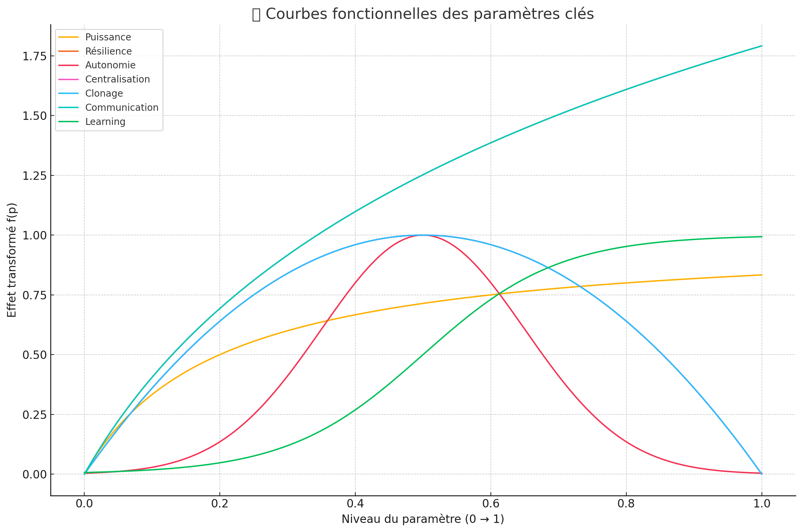
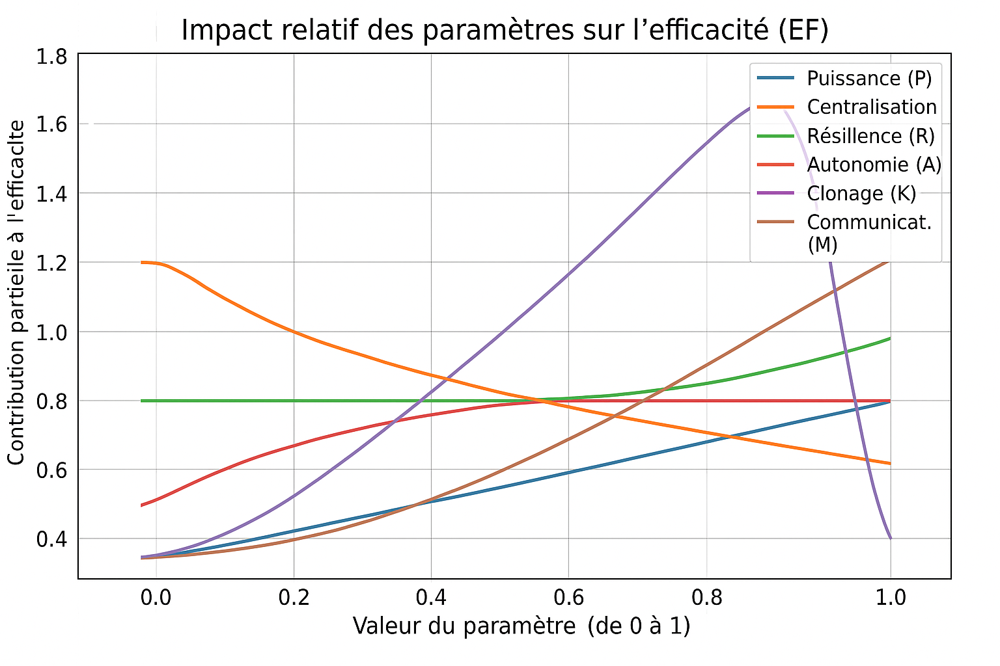
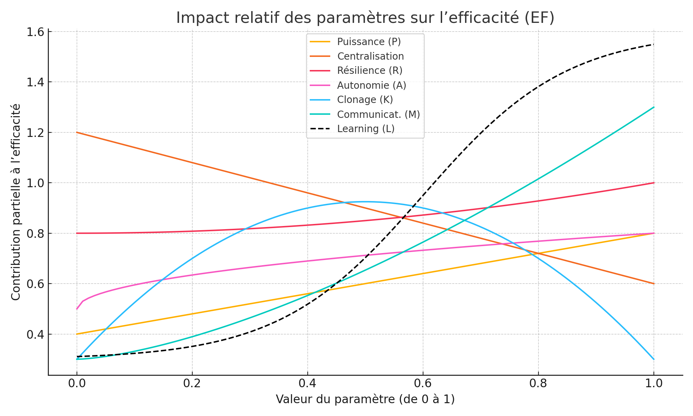

🇬🇧 English version 

# From Physics to Code  
## Using Dimensional Analysis to Decode Power and Performance

---

### 🚧 Background & Origin

While hacking away at the early versions of *R.A.G.E.* (Resilient Autonomous Generative Environment), starting from basic functional blocks and forward projections, I stumbled upon an odd result:  
The embryonic version (v0.3), still very much under development, was showing an **anomalously high efficiency-to-power ratio**.

This raised an immediate question:

> **How could decentralization affect power, and in what way?**

The same question then extended to other parameters: **resilience, autonomy, cloning, communication**...

To investigate this, I turned to a tool well known in physics:  
**Dimensional Analysis** — traditionally used to ensure internal coherence between variables in physical systems.

Surprisingly, this framework gave me exactly what I needed:  
A **qualitative, flexible, systemic model** to simulate and analyze how each parameter influences global efficiency — all within a single equation.

---

### 🧪 Why This Matters

This process reflects my core mindset:  
📌 **Curiosity-driven exploration, mathematical rigor, and resourceful creativity** — even with minimal means.  

I often borrow tools from disciplines like physics or ecology to solve problems in software, modeling, and AI.  
It’s not about complexity — it’s about finding the *right lens* to view a problem.

---

## 🧠 Objective

We aim to **model the effective functional efficiency** of a system based on multiple core parameters.

Each parameter (e.g., Power, Resilience, Autonomy…) represents a **critical property** that contributes to the system’s global performance.

This model is useful for:

- **Simulating system behavior**  
- **Scoring architectures or agents**  
- **Theoretical exploration and design calibration**  

---

## 📐 Base Structure — Efficiency Function

We define:

   math
EF(x) = ∑ᵢ wᵢ · fᵢ(pᵢ)

Where:

    EF(x) is the global system efficiency (or a partial score).

    pᵢ ∈ [0,1] is the normalized value of parameter i.

    fᵢ(pᵢ) is the contribution function for that parameter.

    wᵢ is an optional weight for importance.

🔍 Parameters and Functional Forms
Parameter	Functional Style	Example Function	Interpretation
Power (P)	Linear growth	f(p) = a · p	More power, more efficiency
Centralization (C)	Bell curve (optimum)	f(p) = -a(p - 0.5)² + b	Balance is best
Resilience (R)	Saturating (Hill-like)	f(p) = a·p / (b + p)	Diminishing returns
Autonomy (A)	Gaussian bell	f(p) = exp(−(p − μ)² / 2σ²)	Too much/little is harmful
Cloning (K)	Balanced optimum	f(p) = -a(p - 0.5)² + b	Ideal redundancy at midpoint
Communication (M)	Logarithmic or sigmoid	f(p) = log(1 + a·p) or sigmoid	Slow then sharp improvements
Learning (L)	Sigmoid	f(p) = 1 / (1 + e^(−k(p − θ)))	Threshold-based learning response
🧪 Methodology Summary
Step 1 — Conceptual Analysis

    Define whether a parameter has positive, negative, or optimal effects.

    Detect if it saturates, peaks, or requires balance.

Step 2 — Select Function Type
Situation	Suggested Function
Direct influence	f(p) = a·p
Saturation	f(p) = a·p / (b + p)
Balance/optimum	f(p) = -a(p − p₀)² + b
Threshold effect	Sigmoid or step
Bell curve	Gaussian or exponential decay
Step 3 — Normalize & Calibrate

    All pᵢ are in [0,1]

    Outputs are normalized

    Weights wᵢ allow prioritization

🔄 Empirical vs. Theoretical Models
⚙️ Theoretical Model (Ecological)

    Captures complex real-world effects (feedback loops, optima, saturation)

    Ideal for simulation or adaptive systems

    Often non-linear

📊 Empirical Model (Operational)

    Easy to use for dashboards or scoring

    Generally linear or monotonic

    Lightweight, fast to interpret

🧬 Final Hybrid Model — Synthesized
Parameter	Final Function Example	Function Type
Power (P)	f(p) = a · p	Linear
Centralization (C)	f(p) = -a(p - 0.5)² + b	Bell curve
Resilience (R)	f(p) = a·p / (b + p)	Saturation
Autonomy (A)	f(p) = exp(−(p − 0.7)² / (2·0.22²))	Gaussian bell
Cloning (K)	f(p) = -a(p - 0.5)² + b	Balanced optimum
Communication (M)	f(p) = log(1 + a·p)	Logarithmic growth
Learning (L)	f(p) = 1 / (1 + e^(−k(p − θ)))	Sigmoid

🔗 Integration into the AI Project

This work is not theoretical only — it's a working component in the development of a new type of emergent, generative, autonomous network (R.A.G.E.).

We use these functions as part of:

    Agent simulation & evaluation

    System scoring

    Design iteration & architecture balancing

    Experimental feedback modeling

The method evolves continuously with real testing and minimal compute resources.

    🧑‍💻 Built solo. Still running on a $200 laptop.
    🧠 But powered by curiosity and theoretical edge.

💬 Want to Collaborate?

I’m looking for opportunities to continue building and learning inside forward-thinking teams.
Especially where deep theory meets real-world engineering.

Let’s talk.